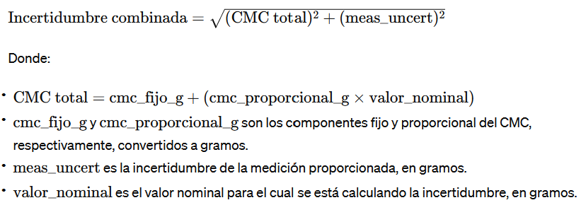

# Calibration Assistant


[](https://www.python.org/downloads/)
[](https://streamlit.io/)


## Overview

Calibration Assistant is a Streamlit-based web application designed to help users search and analyze calibration certificates for various equipment, particularly focusing on scales and balances. The application provides an intuitive interface for accessing detailed certificate information, performing uncertainty calculations, and exploring calibration data.

## Features

- Certificate search by number or model
- Detailed display of certificate information
- Uncertainty calculation based on measurement data and CMC (Calibration and Measurement Capability)
- Support for various units of measurement (g, kg, lb, °C, %RH, °F)
- Interactive UI with a custom theme

## Uncertainty Calculation Formula

The application uses the following formula to calculate the combined uncertainty:



Where:
- CMC total = cmc_fijo_g + (cmc_proporcional_g × valor_nominal)
- cmc_fijo_g and cmc_proporcional_g are the fixed and proportional components of the CMC, respectively, converted to grams.
- meas_uncert is the provided measurement uncertainty, in grams.
- valor_nominal is the nominal value for which the uncertainty is being calculated, in grams.

 
## Functionality Demo

Here's a brief demonstration of the application's functionality:


## Technical Stack

- **Frontend**: Streamlit
- **Backend**: Python
- **Data Storage**: JSON files

## File Structure

- `app.py`: Main application file containing the Streamlit UI and core logic
- `config.toml`: Streamlit configuration file for custom theming
- `htmlTemplates.py`: HTML and CSS templates for custom styling
- `ScalesBalances.py`: Core functions for data processing and calculations
- `Balances&Scales.json`: JSON data file containing calibration information for balances and scales

## Setup and Installation

1. Clone the repository:
   ```
   git clone https://github.com/your-repo/calibration-assistant.git
   cd calibration-assistant
   ```

2. Install the required dependencies:
   ```
   pip install -r requirements.txt
   ```

3. Run the Streamlit app:
   ```
   streamlit run app.py
   ```

## Usage

1. **Certificate Search**: Enter a certificate number or search by model to view detailed information about a specific calibration.

2. **Uncertainty Calculation**: Select a target group, nominal value, and unit to perform uncertainty calculations based on the certificate data and CMC values.

3. **Data Exploration**: Browse through available certificates, models, and calibration data using the interactive interface.

## Key Components

### Data Processing (`ScalesBalances.py`)

- `cargar_json()`: Loads JSON data files
- `buscar_en_labrowe_datalogger()`: Searches for specific measurement data in the LabRowe datalogger
- `convertir_unidad()`: Converts between different units of measurement
- `identificar_rango_en_certificado()`: Identifies the appropriate CMC range for a given measurement
- `calcular_incertidumbre()`: Calculates the total uncertainty based on measurement data and CMC values

### User Interface (`app.py`)

- Streamlit-based UI with custom CSS styling
- Interactive components for data input and result display
- Conditional rendering based on user selections

### Data Storage

- JSON files store calibration data, CMC values, and certificate information
- `Balances&Scales.json`: Contains CMC data for various measurement ranges

## Customization

The application's appearance can be customized by modifying the `config.toml` file and the CSS styles in `htmlTemplates.py`.

## License

Licensed under the MIT License. See [LICENSE](LICENSE) for details.


